# SAP RFC to S3 using AWS Glue

In this lab, we will learn how to perform a SAP Remote Function Call (RFC) via AWS Glue and store the output in Amazon S3. The architecture will be as following.

## Table of Contents

1. [Overview](#1-overview)
    - 1.1.[Cost](#11-cost)
2. [Prerequisites](#2-prerequisites)
    - 2.1.[Build PyRFC as an additional Python module for Glue](#21-build-pyrfc-as-an-additional-python-module-for-glue)
3. [Deployment Steps](#3-deployment-steps)
    - 3.1.[Preparation steps](#31-preparation-steps)
    - 3.2.[CloudFormation template deployment](#32-cloudformation-template-deployment)
4. [Deployment Validation](#4-deployment-validation)
5. [Running the Guidance](#5-running-the-guidance)
6. [Next Steps](#6-next-steps)
7. [Cleanup](#7-cleanup)

## 1. Overview 

For users who want to extract data from SAP and transfer it to AWS data lake on top of Amazon S3, but have technical limitations to use [SAP OData connector for Amazon AppFlow](https://docs.aws.amazon.com/appflow/latest/userguide/sapodata.html) (such as using the lower version than SAP NW 7.4 or having difficulty setting up SAP OData), We will learn how to extract data from AWS Glue by connecting to SAP with SAP RFC.

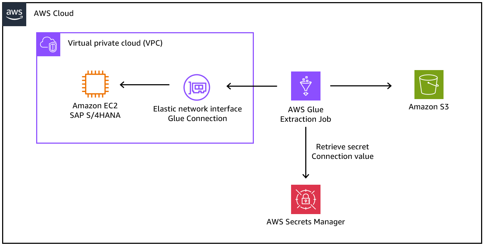

### 1.1. Cost
With AWS Glue, you only pay for the time that your ETL job takes to run. There are no resources to manage and no upfront costs, and you are not charged for startup or shutdown time. AWS charges an hourly rate based on the number of data processing units (DPUs) used to run your ETL job. We will use the below properties related with [Glue job cost](https://aws.amazon.com/glue/pricing/?nc1=h_ls).

- Job type : **Spark**
- Glue version : **Glue 3.0**
- Worker type: **G.1x**
- Requested number of workers: **2**

The price varies by AWS region, but is **$0.44 per DPU-Hour** for running a Glue job in us-east-1. Consider a job that runs for **15 minutes** and uses **6 DPU**. Since your job ran for 1/4th of an hour and used 6 DPUs, AWS will bill you 6 DPU * 1/4 hour * $0.44, or $0.66. Depending on the size of your table, the job execution time and DPUs required can vary, so we recommend that you refer to [Monitoring DPU Capacity Planning](https://docs.aws.amazon.com/glue/latest/dg/monitor-debug-capacity.html) to estimate DPU requirements for your job.

- [AWS Glue Pricing](https://aws.amazon.com/glue/pricing/?nc1=h_ls)
- [Monitoring for DPU capacity planning](https://docs.aws.amazon.com/glue/latest/dg/monitor-debug-capacity.html)

## 2. Prerequisites

The [pyrfc](https://github.com/SAP/PyRFC) Python package provides Python bindings for SAP NetWeaver RFC Library, for a comfortable way of calling ABAP modules from Python and Python modules from ABAP, via SAP Remote Function Call (RFC) protocol.

- With AWS Glue version 2.0+, you can install additional Python modules. To add a new module, **--additional-python-modules** job parameter key with a value containing a list of comma-separated Python modules. This allows your AWS Glue 2.0 ETL job to install the additional modules using the Python package installer (pip3)

- We will use docker to build the additional python module. For your convenience, we recommend installing docker on your Amazon EC2 environment and then proceed with the steps below. Please refer to the link below to install docker.
    - [Installing Docker](https://docs.aws.amazon.com/serverless-application-model/latest/developerguide/install-docker.html)


### 2.1. Build PyRFC as an additional Python module for Glue

To access SAP via RFC from AWS Glue, the [PyRFC](https://github.com/SAP/PyRFC) library needs to be installed as [external library](https://docs.aws.amazon.com/glue/latest/dg/aws-glue-programming-python-libraries.html) in Glue following [this guide](https://repost.aws/knowledge-center/glue-version2-external-python-libraries) (AWS Glue 3.0 External library build).

To begin, download the [SAP NW RFC SDK](https://launchpad.support.sap.com/#/softwarecenter/template/products/_APP=00200682500000001943&_EVENT=DISPHIER&HEADER=Y&FUNCTIONBAR=N&EVENT=TREE&NE=NAVIGATE&ENR=01200314690100002214&V=MAINT)
→ "LINUX ON X86_64 64BIT" from SAP Download Center to your local disk (requires SAP S-User). The latest patch level at the time this workshop is created is 12.


Access your OS envrionment, Upload the downloaded zip file your AWS Cloud9 environment. The zip file will placed in the folder as bellow.


Extract all files by executing the following statements in your OS envrionment.  

```bash
cd /home/ec2-user/environment
mkdir -p gluerfcbuild
unzip nwrfc750P_12-70002752.zip -d ./gluerfcbuild/
cd gluerfcbuild
```

The result should look as follows: 


Move to gluerfcbuild folder as the next commands need to be run inside this folder.


Download the following docker file template from github to build the external library. You can also manually download the **glue-pyrfc-docker** file from **glue_external_lib** folder from [Github repository](https://github.com/aws-samples/aws-sap-gluerfc/blob/main/glue_external_lib/glue-pyrfc-docker), then manually upload to your Cloud9 environment.
Commands in the docker file shall be used without modification.

```bash
git clone https://github.com/aws-samples/aws-sap-gluerfc.git
cp -pr ./aws-sap-gluerfc/glue_external_lib/glue-pyrfc-docker .
```

Build the image using the docker file: 
```bash
sudo service docker restart
docker build -f glue-pyrfc-docker .
```

After build is complete, an output message will be displayed with an image ID. 

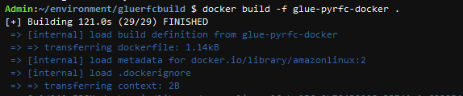

You can confirm the image ID with this command:
```bash
docker image ls
```

Note the image ID generated. For Example: **1cf8a169e460**

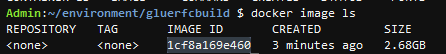

Run the container (Note: Use your own individual **ImageID** after the build) 
```bash
# Run container: docker run -dit <ImageID>
docker run -dit 1cf8a169e460
```

Get the container ID by this command
```bash
# Get the ContainerID 
docker ps
```
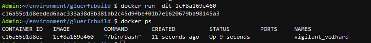

Confirm the .whl file name inside Container wheel directory by this command
```bash
# Fill your Container ID in the command. Ex: c16a55b1d8ee
docker exec <Container ID> ls -al /root/wheel_dir
```
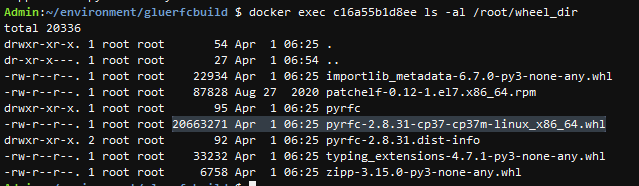

Copy wheel_dir folder that contain the .whl file with file name started with pyrfc- built from Container to Cloud9 folder. We will use this file later to upload to S3.
```bash
# Copy .whl out of docker to cloud9. Remember to replace your Container ID
# and re-confirm the pyrfc file name again to match with your container
docker cp <Container ID>:/root/wheel_dir/ .
```
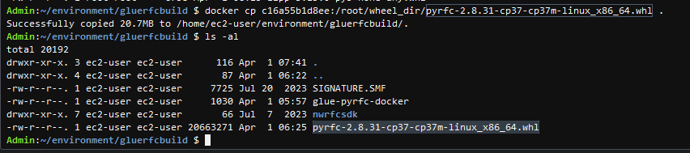

Use the following command to upload **.whl** file with file name started with pyrfc- to Amazon S3. Note: Modify the **bucket name** and **folder name** according to your environment! 
```bash
aws s3 cp ./wheel_dir/pyrfc*.whl s3://<bucket name>/<folder name>/
```
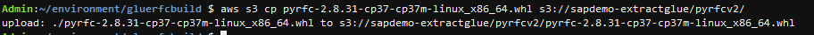

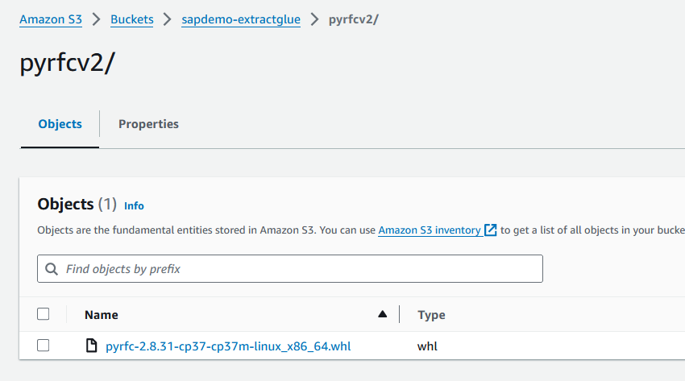

## 3. Deployment Steps

We will create a secret of [AWS Secret Manager](https://aws.amazon.com/secrets-manager/?nc1=h_ls) to save the SAP connection information and deploy AWS Glue job using AWS CloudFormation.

### 3.1. Preparation steps:

The script of AWS Gloud job is [pyrfc_read_table.py](https://github.com/aws-samples/aws-sap-gluerfc/blob/main/pyrfc_read_table/pyrfc_read_table.py) inside folder pyrfc_read_table. We need to upload it to an Amazon S3 bucket to automatically deploy the Glue job through CloudFormation. You can create new S3 bucket or re-use the bucket above used to upload .whl file.

```bash
aws s3 cp ./aws-sap-gluerfc/pyrfc_read_table/pyrfc_read_table.py s3://<bucket name>/<folder name>/
```

[Github repository](https://github.com/aws-samples/aws-sap-gluerfc/blob/main/pyrfc_read_table/pyrfc_read_table.py)

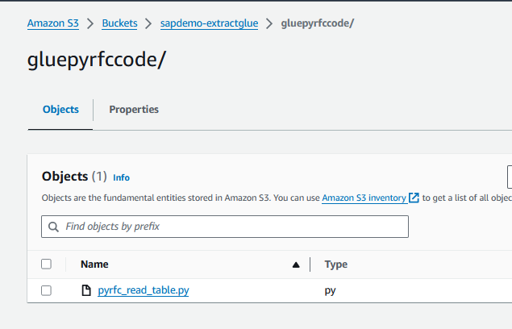

Access [Secret Manager](https://ap-northeast-1.console.aws.amazon.com/secretsmanager/landing?region=ap-northeast-1) service and click **Store a new secret** .

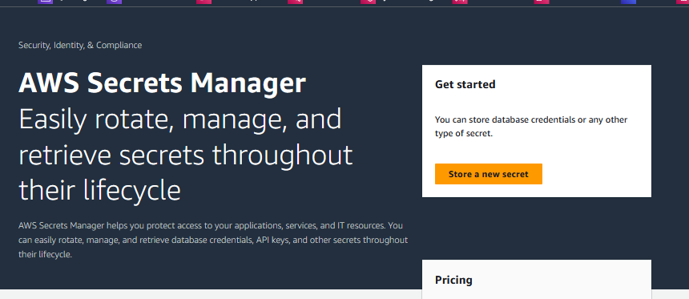

Choose **Secret type** = **Other type of secret**. In Key/value pairs session, input SAP connection information.
Remember to type your own system information here.

- ashost : Private IP address or hostname of SAP Application server.
- client: Client to login to SAP
- sysnr: Instance number
- user: User to login to SAP
- passwd: password to login to SAP

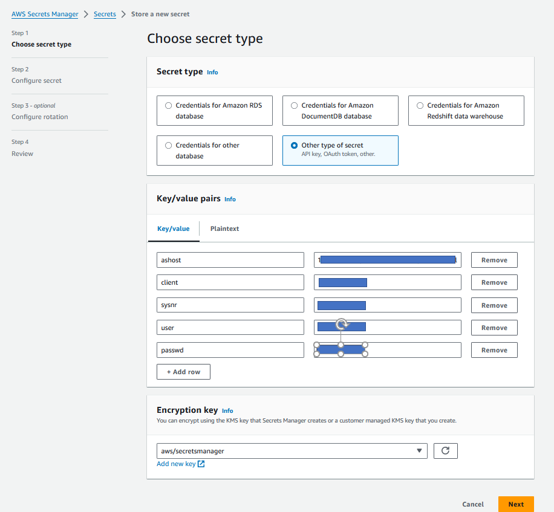

In the **Next** screen, define **Secret Name**.
In the **Next** screen, leave all fields as default and finally click **Store secret**.

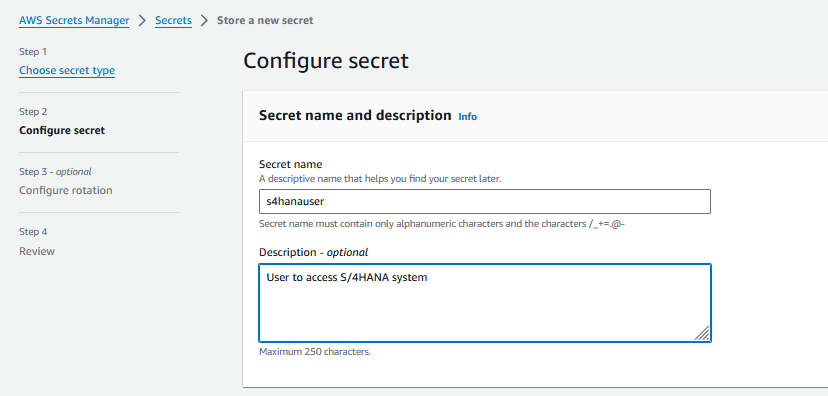

When successfuly create Secret Manager, review it and Copy the **Secret ARN** to input to CloudFormation later.

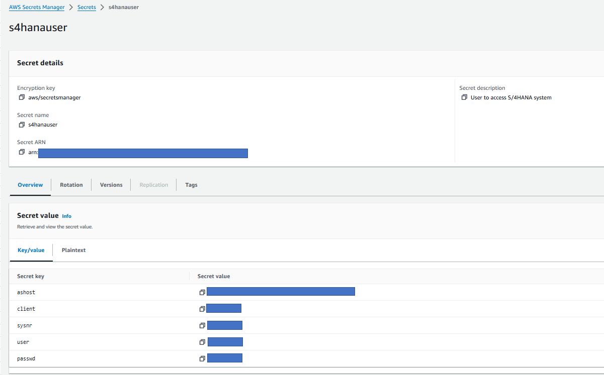

### 3.2. CloudFormation template deployment:
Go to [CloudFormation console](https://ap-northeast-1.console.aws.amazon.com/cloudformation/home?region=ap-northeast-1#/getting-started) and Click **Creat Stack**

From **Specify template**, choose **Upload a template file**, then upload the **glue-py-rfc.yaml** file inside folder automation.

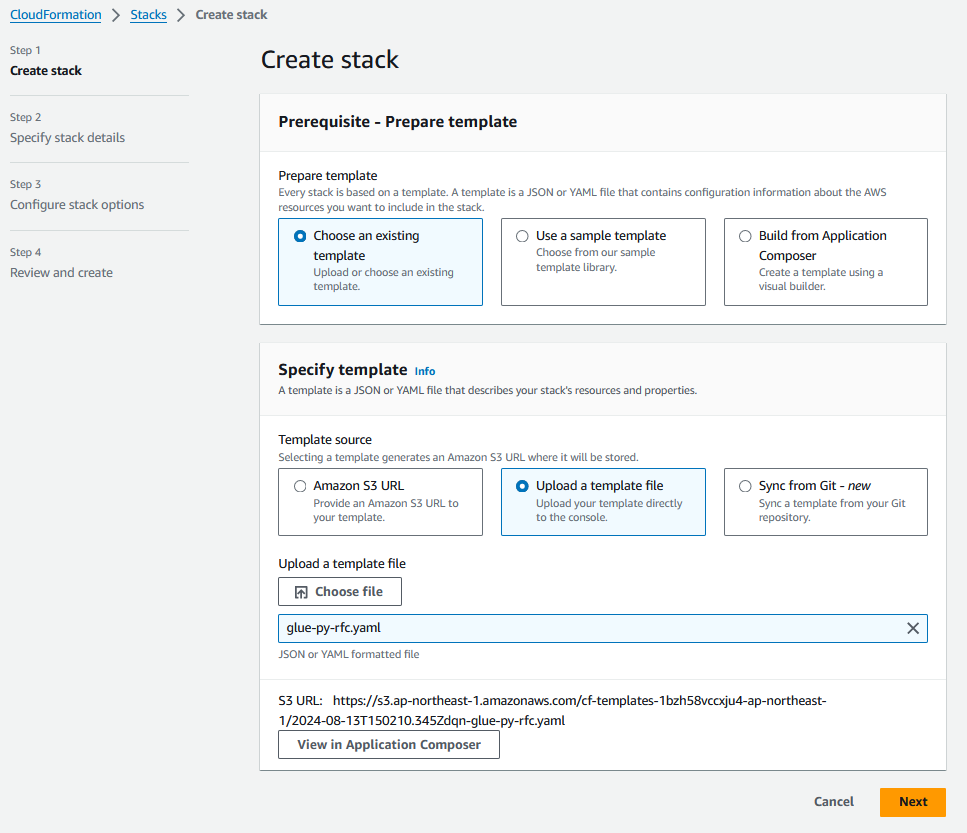

Click **Next** and input the parameters with your own environment values

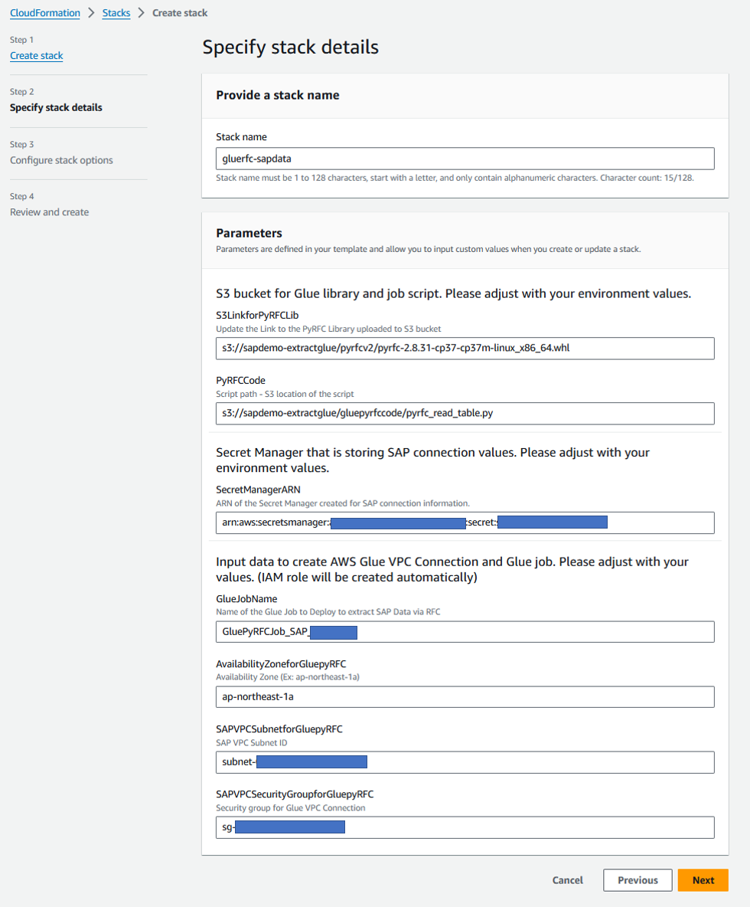

Click **Next** to go through the screens to the last **Review and create** screen. In the bottom of the page, click in the check box "I acknowledge that AWS CloudFormation might create IAM resources with custom names." and **Submit** to start deployment

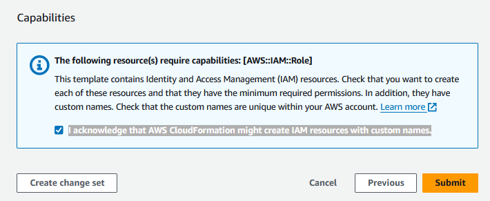

## 4. Deployment Validation

We will see the status of AWS CloudFormation stack to validate AWS Glue job deployment. If the status is **CREATE_COMPLETE**, it does mean successfully deploying it.
    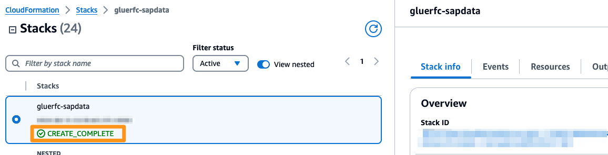


See the resources deployed including IAM role for Glue job, Glue VPC Connection, Glue Job.
    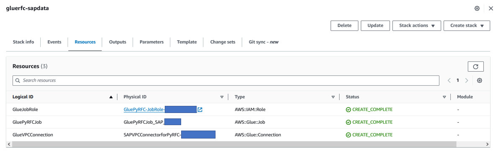

And access [AWS Glue Studio](https://us-east-1.console.aws.amazon.com/gluestudio/home) console. From left menu select Connectors, we can confirm the VPC Connector deployed by CloudFormation.
    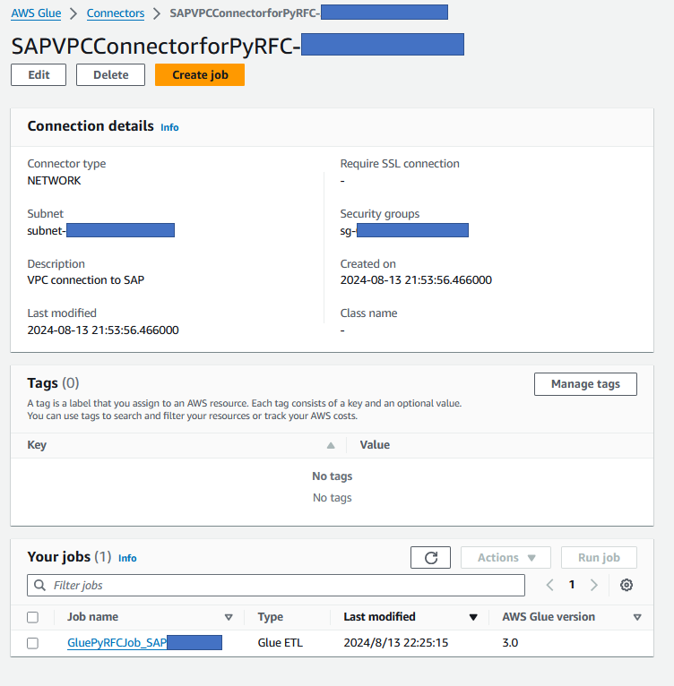

## 5. Running the Guidance

In the glue job's Editor screen you can confirm the code of the job deployed by CloudFormation. For your reference, [pyrfc_read_table.py](https://github.com/aws-samples/aws-sap-gluerfc/blob/main/pyrfc_read_table/pyrfc_read_table.py) code logic is as follow:

1. Setup Parameter: Define Secret Manager name and region, Amazon S3 Bucket to save extracted data, Output file format, Table name to extracted from SAP and other options. You should adjust these parameters with your own values before running the job.
2. List of fixed parameter: RFC function to read table, and Amazon S3 folder/subfolder format using job execution datetime. You don't need to modify this to run the job.
3. Code of each function will be executed

    3.1 This is the main function, it will:
    * Call RFC connect to SAP with login credenticals from Secret Manager
    * Read data from defined SAP table, write into output files and save to Amazon S3 bucket.
    
    3.2 Function to Read SAP system address and login credenticals from Secret manager

    3.3 Function to validate data read from SAP

    3.4 Function to write data from SAP to output files

    3.5 Function to save output files to Amazon S3 folder in defined path

4. Main program: Execute main function 3.1

Please make sure modify the parameters that as marked as **#Adjust** to meet your own environment values.
- Secret Manager name
- AWS region
- S3 bucket name to store extracted data
- Target table name to be extracted
- You can also adjust rowCount if necessary
- On the Job details tab, check the **IAM Role** permissions.
    - If you set the Glue additional Library, script bucket differently from the bucket where you stored SAP data, you need to add get permissions for each bucket to the IAM Role created from Cloudformation. Connect to the [IAM Role console](https://us-east-1.console.aws.amazon.com/iam/home?region=us-east-1#/roles), look up the **Glue Job Name** you entered, and update the permissions.

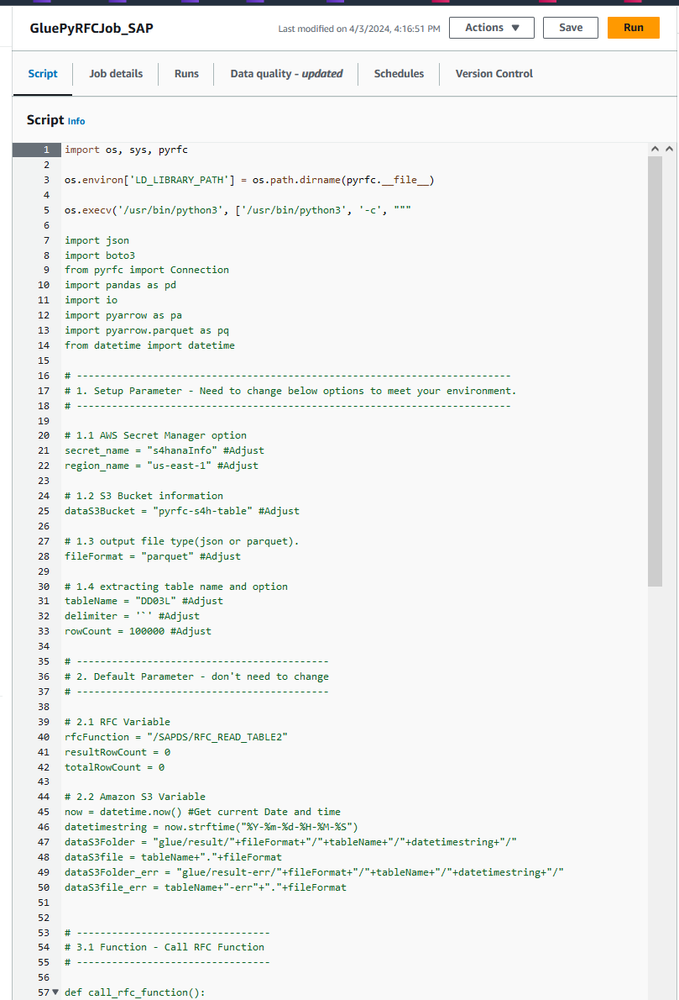

Click **Save** to save the parameters you modified and now you can **Run** the job

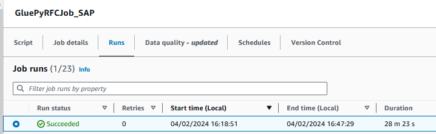

Finally, navigate to your Amazon S3 bucket and validate the extracted file. 


## 6. Next Steps

We can also monitor the ouput logs of Glue job and know how many extracted rows in the table which you selected. 

- If we look the **Run details** under the run tab of the glue job, we'll see the  link of CloudWatch Ouput logs. 
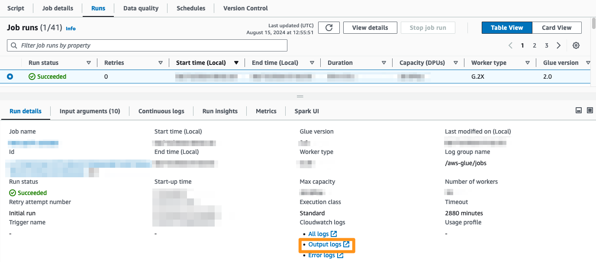

- Click the Log stream and we can see output of Glue job.
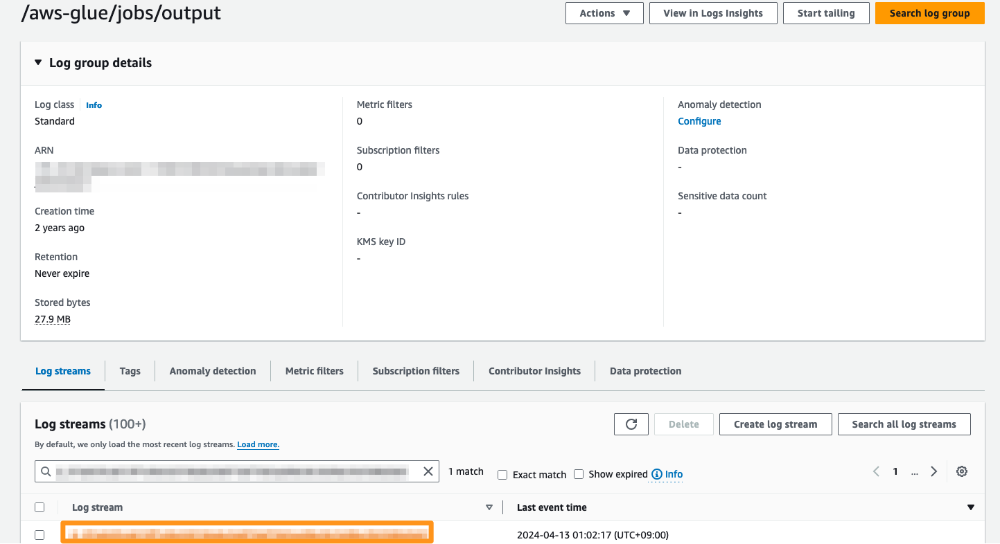
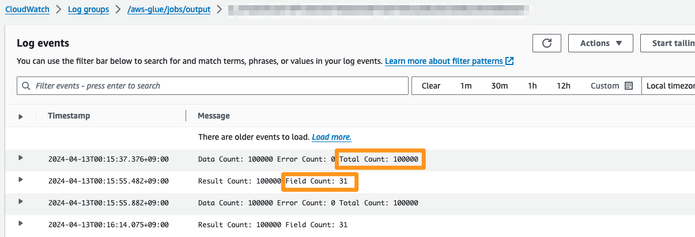


## 7. Cleanup

To cleanup resources we created, We will delete the CloudFormation Stack.

- Go to [CloudFormation console](https://ap-northeast-1.console.aws.amazon.com/cloudformation/home?region=ap-northeast-1#/getting-started), select the Stack which we created before and click **Delete** button. And Click **Delete** button again.
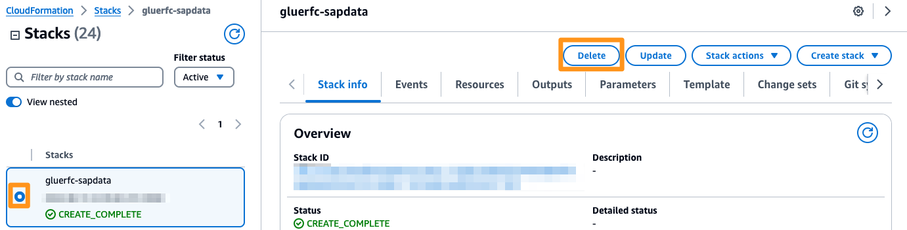

## Security

See [CONTRIBUTING](CONTRIBUTING.md#security-issue-notifications) for more information.

## 

## License

This library is licensed under the MIT-0 License. See the LICENSE file.
