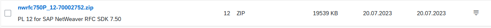
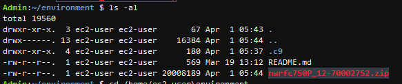
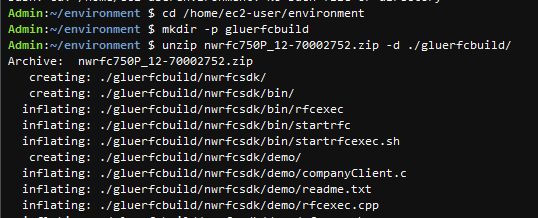
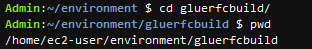

# SAP RFC to S3 using AWS Glue

In this lab, you will learn how to perform a SAP Remote Function Call (RFC) via AWS Glue and store the output in Amazon S3. For ease of use, we will be using [AWS Cloud9](https://catalog.us-east-1.prod.workshops.aws/workshops/79435b9d-cf2e-4afc-a3f6-4eceeaf0865d/en-US/aws-devops/200-sap-cicd-cf/211-aws-cloud9) as IDE.
Please make sure to:
* Create your [AWS Cloud9](https://catalog.us-east-1.prod.workshops.aws/workshops/79435b9d-cf2e-4afc-a3f6-4eceeaf0865d/en-US/aws-devops/200-sap-cicd-cf/211-aws-cloud9) environment before starting the workshop.
* The docker image will take about 2~3GB disk size. So please make sure your Cloud9 environment has enough storage size. 
You can provision a sufficent storage size (for Example 15GB or 20GB) when creating Cloud9, or refer to [this link](https://docs.aws.amazon.com/cloud9/latest/user-guide/move-environment.html) to extend the EBS size of an existing environment.

## 1. Build PyRFC as External Library for Glue

To access SAP via RFC from AWS Glue, the [PyRFC](https://github.com/SAP/PyRFC) library needs to be installed as [external library](https://docs.aws.amazon.com/glue/latest/dg/aws-glue-programming-python-libraries.html) in Glue following [this guide](https://repost.aws/knowledge-center/glue-version2-external-python-libraries) (AWS Glue 3.0 External library build).

To begin, download the [SAP NW RFC SDK](https://launchpad.support.sap.com/#/softwarecenter/template/products/_APP=00200682500000001943&_EVENT=DISPHIER&HEADER=Y&FUNCTIONBAR=N&EVENT=TREE&NE=NAVIGATE&ENR=01200314690100002214&V=MAINT)
→ "LINUX ON X86_64 64BIT" from SAP Download Center to your local disk (requires SAP S-User). The latest patch level at the time this workshop is created is 12.



Access your AWS Cloud9 Studio, Upload the downloaded zip file your AWS Cloud9 environment. The zip file will placed in the folder as bellow.



Extract all files by executing the following statements in your Cloud9 terminal.  

```bash
cd /home/ec2-user/environment
mkdir -p gluerfcbuild
unzip nwrfc750P_12-70002752.zip -d ./gluerfcbuild/
cd gluerfcbuild
```

The result should look as follows: 



Move to gluerfcbuild folder as the next commands need to be run inside this folder.



Download the following docker file template from github to build the external library. You can also manually download the **glue-pyrfc-docker** file from **glue_external_lib** folder from [Github repository](https://github.com/aws-samples/aws-sap-gluerfc/blob/main/glue_external_lib/glue-pyrfc-docker), then manually upload to your Cloud9 environment.
Commands in the docker file shall be used without modification.
```bash
curl -L -O https://github.com/aws-samples/aws-sap-gluerfc/blob/main/glue_external_lib/glue-pyrfc-docker
```

Build the image using the docker file: 
```bash
sudo service docker restart
docker build -f glue-pyrfc-docker .
```

After build is complete, an output message will be displayed with an image ID. 


You can confirm the image ID with this command:
```bash
docker image ls
```

Note the image ID generated. For Example: **1cf8a169e460**


Run the container (Note: Use your own individual **ImageID** after the build) 
```bash
# Run container: docker run -dit <ImageID>
docker run -dit 1cf8a169e460
```

Get the container ID by this command
```bash
# Get the ContainerID 
docker ps
```


Confirm the .whl file name inside Container wheel directory by this command
```bash
# Fill your Container ID in the command. Ex: c16a55b1d8ee
docker exec <Container ID> ls -al /root/wheel_dir
```


Copy the .whl file with file name started with pyrfc- built from Container to Cloud9 folder. We will use this file later to upload to S3.
```bash
# Copy .whl out of docker to cloud9. Remember to replace your Container ID
# and re-confirm the pyrfc file name again to match with your container
docker cp <Container ID>:/root/wheel_dir/pyrfc-2.8.31-cp37-cp37m-linux_x86_64.whl .
```


Use the following command to upload the created **.whl** file to Amazon S3. Note: Modify the **file name, bucket name** and **folder name** according to your environment! 
```bash
aws s3 cp pyrfc-2.8.31-cp37-cp37m-linux_x86_64.whl s3://<bucket name>/<folder name>/
```


## 2. Create Secrets Manager to save SAP connection information securely
Access [Secret Manager](https://ap-northeast-1.console.aws.amazon.com/secretsmanager/landing?region=ap-northeast-1) service and click **Store a new secret** .


Choose **Secret type** = **Other type of secret**. In Key/value pairs session, input SAP connection information.
Remember to type your own system information here.

- ashost : Private IP address or hostname of SAP Application server.
- client: Client to login to SAP
- sysnr: Instance number
- user: User to login to SAP
- passwd: password to login to SAP


In the **Next** screen, define **Secret Name**.
In the **Next** screen, leave all fields as default and finally click **Store secret**.


## 3. Create AWS Glue job

Create a custom Glue job to perform the SAP RFC call using the external library.

Access [AWS Glue Studio](https://us-east-1.console.aws.amazon.com/gluestudio/home) console.

To access your SAP system in a particular existing VPC, create a new **connection** at the bottom of the **Connectors** menu. After entering the options below, click the **Create connection** button to create a **connection**.
* Name : < Connection Name >
* Network options 
    * VPC : < Your SAP VPC >
    * Subnet : < ... >
    * Security Group : < ... > 


After create your VPC Connection, Goto **ETL Jobs** in the Menu, choose **Script editor**


Choose **Spark** Engine, and click **Create script**.


In the Editor screen, define **Job name**, and Copy the code from **pyrfc_read_table.py** inside folder **pyrfc_read_table** in the [Github repository](https://github.com/aws-samples/aws-sap-gluerfc/blob/main/pyrfc_read_table/pyrfc_read_table.py) to the script window.
For your reference, **pyrfc_read_table.py** code logic is as follow:

1. Setup Parameter: Define Secret Manager name and region, Amazon S3 Bucket to save extracted data, Output file format, Table name to extracted from SAP and other options. You should adjust these parameters with your own values before running the job.
2. List of fixed parameter: RFC function to read table, and Amazon S3 folder/subfolder format using job execution datetime. You don't need to modify this to run the job.
3. Code of each function will be executed

    3.1 This is the main function, it will:
    * Call RFC connect to SAP with login credenticals from Secret Manager
    * Read data from defined SAP table, write into output files and save to Amazon S3 bucket.
    
    3.2 Function to Read SAP system address and login credenticals from Secret manager

    3.3 Function to validate data read from SAP

    3.4 Function to write data from SAP to output files

    3.5 Function to save output files to Amazon S3 folder in defined path

4. Main program: Execute main function 3.1

Please make sure modify the parameters that as marked as **#Adjust** for Secret Manager name, region, S3 bucket name, Table.


Next, click on the Job details tab, to specify connection, IAM Role and Job parameter to pass the external Library as follows:

* Name: < Pick a Name >
* IAM Role: < Glue role with required permissions > (cf. Create an IAM role for AWS Glue )
    * This should include access to Amazon S3 and **SecretsManagerReadWrite**

    

* Glue version: Glue 3.0
* Advanced properties are as following. Please confirm and adjust .whl file name to match with your environment if necessary.
    * Connections: Select the connection you created.
    * Click Add new parameter in Job parameters and enter as below.
    * Key: --additional-python-modules
    * Value: s3://< bucket name >/< folder name >/**pyrfc-2.8.31-cp37-cp37m-linux_x86_64.whl**

    

Click **Save** to create the job and now you can **Run** the job


Finally, navigate to your Amazon S3 bucket and validate the extracted file. 


## 

## Security

See [CONTRIBUTING](CONTRIBUTING.md#security-issue-notifications) for more information.

## 

## License

This library is licensed under the MIT-0 License. See the LICENSE file.
